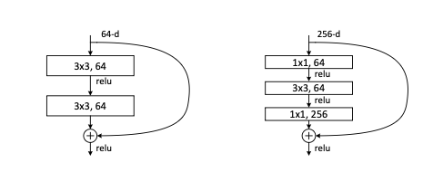
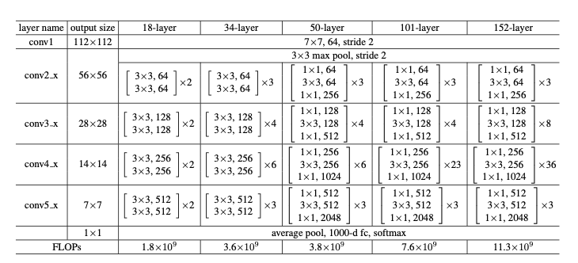
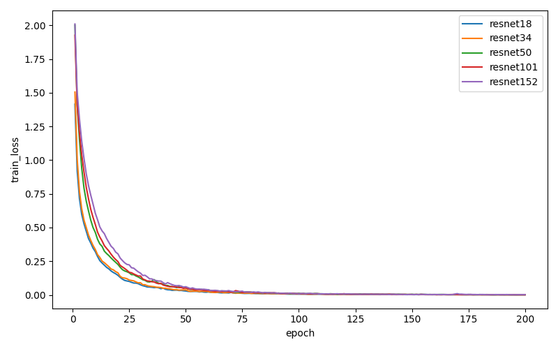
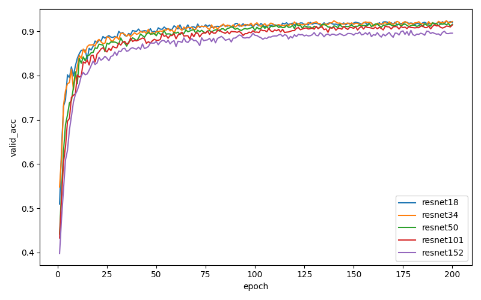
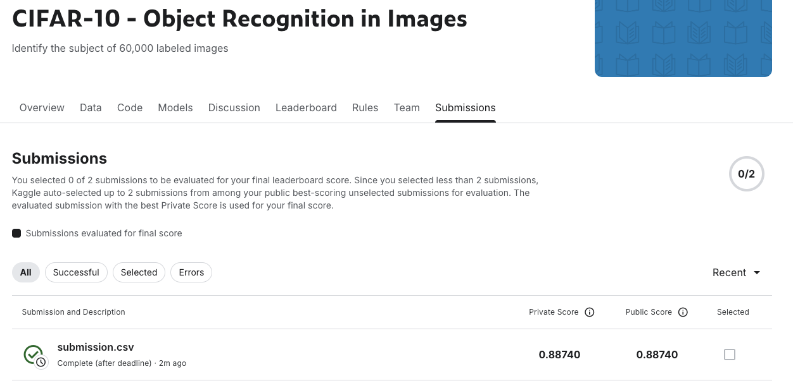
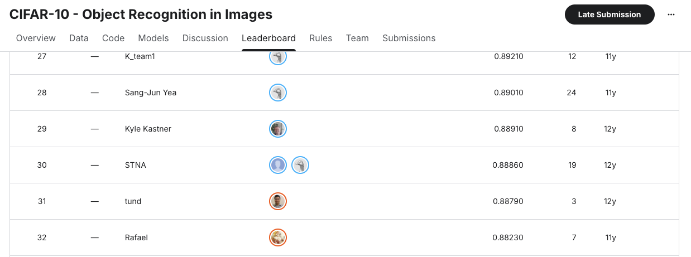

# CIFAR-10 图像分类项目

## 项目简介

本项目使用深度残差网络（ResNet）对 CIFAR-10 数据集进行图像分类。CIFAR-10 是一个经典的计算机视觉数据集，包含 10 个类别的 32×32 彩色图像，常用于图像分类任务的基准测试。（数据集来自于Kaggle竞赛，竞赛网址为：https://www.kaggle.com/competitions/cifar-10）

## 项目解决的问题

本项目旨在解决 CIFAR-10 数据集的图像分类问题，即对输入的 32×32 彩色图像进行自动分类，识别图像属于以下 10 个类别中的哪一个：
- 飞机 (airplane)
- 汽车 (automobile)
- 鸟 (bird)
- 猫 (cat)
- 鹿 (deer)
- 狗 (dog)
- 青蛙 (frog)
- 马 (horse)
- 船 (ship)
- 卡车 (truck)

## 技术架构

### 使用的模型

本项目通过PyTorch实现了多种 ResNet 架构，并经过实验验证，最终选择 **ResNet-18** 作为最佳模型：

- **ResNet-18**: 18 层深度残差网络（最终采用）
- **ResNet-34**: 34 层深度残差网络
- **ResNet-50**: 50 层深度残差网络（使用 Bottleneck 结构，有效减少参数数量）
- **ResNet-101**: 101 层深度残差网络（使用 Bottleneck 结构，有效减少参数数量）
- **ResNet-152**: 152 层深度残差网络（使用 Bottleneck 结构，有效减少参数数量）

Bottleneck结构（下图右边）：



模型结构：



所有模型都针对 CIFAR-10 的 32×32 图像尺寸进行了适配：

- 使用 3×3 卷积核替代原始 ResNet 的 7×7 卷积
- 移除了最大池化层
- 使用全局平均池化层

### 技术特点

1. **数据增强**：
   - 随机调整大小裁剪（RandomResizedCrop）
   - 随机水平翻转（RandomHorizontalFlip）
   - 图像归一化（使用 CIFAR-10 标准均值和标准差）

2. **训练策略**：
   - 使用 SGD 优化器（momentum=0.9）
   - 学习率衰减策略（StepLR，每 10 个 epoch 衰减为原来的 0.9 倍）
   - 权重衰减（weight decay）防止过拟合
   - 支持多 GPU 并行训练

3. **模型评估**：
   - 训练集/验证集划分（90%/10%）
   - 实时训练过程可视化
   - 训练日志记录（CSV 格式）

## 项目结构

```
cifar-10/
├── data/                    # 数据目录
│   └── cifar-10/
│       ├── train/          # 训练图像
│       ├── test/           # 测试图像
│       └── trainLabels.csv # 训练标签
├── logs/                    # 训练日志
│   ├── train/              # 完整训练集训练日志
│   └── train_valid/        # 验证集训练日志
├── trained_models/         # 训练好的模型权重
│   └── resnet18_cifar10.pth
├── submission/             # 测试集预测结果
│   └── submission.csv
├── main.py                 # 主程序入口
├── model.py                # ResNet 模型定义
├── train.py                # 训练函数
├── utils.py                # 工具函数和数据集类
└── README.md               # 项目说明文档
```

## 环境要求

- Python 3.9
- torch
- torchvision
- pandas
- numpy
- PIL (Pillow)
- matplotlib
- d2l (用于可视化)
具体依赖版本要求见requirements.txt

## 使用方法

### 1. 数据准备
本项目的数据来自于Kaggle竞赛，竞赛网址为：https://www.kaggle.com/competitions/cifar-10
因为该数据集的测试集较大（30万张测试图片），因此本项目只提供下载地址：https://www.kaggle.com/competitions/cifar-10/data，请自己解压。
将数据集解压在放置在 `data/cifar-10/` 目录下，目录结构如下：
```
data/cifar-10/
├── train/              # 训练图像文件夹
├── test/               # 测试图像文件夹
├── trainLabels.csv     # 训练标签文件
```

### 2. 模型训练

#### 训练并调整参数（使用验证集）

```python
from main import main

# 训练 ResNet-18 模型并调整参数
main(batch_size=128, is_test=False, is_validate=True, model_name='resnet18')
```

#### 使用调好的参数在完整训练集上训练

```python
# 使用调好的超参数在完整训练集上训练
main(
    batch_size=128, 
    is_test=False, 
    is_validate=False, 
    model_name='resnet18',
    num_epochs=200,
    lr=0.00005,
    wd=5e-4,
    lr_period=10,
    lr_decay=0.9
)
```

#### 对测试集进行预测

```python
# 使用训练好的模型对测试集进行分类
main(batch_size=128, is_test=True, is_validate=False, model_name='resnet18')
```

### 3. 支持的模型

可以通过 `model_name` 参数选择不同的 ResNet 模型：
- `'resnet18'`
- `'resnet34'`
- `'resnet50'`
- `'resnet101'`
- `'resnet152'`

## 训练结果

### ResNet-18 模型性能

经过 200 个 epoch 的训练，ResNet-18 模型在验证集上取得了以下最佳性能：

- **验证集准确率**: 92.42%（第 197 个 epoch）
- **最终验证集准确率**: 91.76%
- **训练集准确率**: 99.95%

### 超参数设置

- **批次大小 (batch_size)**: 128
- **学习率 (learning rate)**: 0.00005
- **权重衰减 (weight decay)**: 5e-4
- **学习率衰减周期 (lr_period)**: 10
- **学习率衰减率 (lr_decay)**: 0.9
- **训练轮数 (epochs)**: 200
- **优化器**: SGD (momentum=0.9)

### 模型对比

项目中对多种 ResNet 架构进行了对比实验，最终发现 ResNet-18 在 CIFAR-10 数据集上表现最佳，在准确率和训练效率之间取得了良好的平衡。

#### 训练损失



#### 验证集准确率



## 文件说明

- **main.py**: 主程序，包含数据加载、模型训练和测试的完整流程
- **model.py**: 实现了 ResNet-18/34/50/101/152 模型架构
- **train.py**: 包含模型训练的核心函数
- **utils.py**: 工具函数，包括数据集类、评估函数、日志记录等

## 训练日志

训练过程中的损失和准确率会被记录在 `logs/` 目录下：
- `logs/train_valid/`: 包含验证集评估的训练日志
- `logs/train/`: 在完整训练集上训练时的日志

日志文件为 CSV 格式，包含以下字段：
- `epoch`: 训练轮数
- `train_loss`: 训练损失
- `train_acc`: 训练准确率
- `valid_acc`: 验证准确率（如果使用验证集）

## 输出结果

测试集预测结果保存在 `submission/submission.csv` 文件中，包含两列：
- `id`: 图像 ID
- `label`: 预测的类别标签
将测试集预测结果提交至Kaggle竞赛，取得了0.8874的得分，可以在Leaderboard上排在32位。





## 注意事项

1. 确保有足够的 GPU 内存（建议至少 6GB）
2. 训练过程可能需要较长时间，建议使用 GPU 加速
3. 如果模型文件不存在，测试功能会提示错误，需要先训练模型


## 结论

​	本项目系统性地对比了不同深度的残差神经网络（ResNet-18/34/50/101/152）在 CIFAR-10 数据集上的分类性能。通过实验验证，我们得出以下主要结论：

### 1. 残差网络的核心优势

​	残差神经网络通过引入跳跃连接（skip connection）机制，有效解决了深层网络中的梯度消失问题。这一设计使得网络理论上可以构建到任意深度，而不会出现传统卷积神经网络在深度增加时出现的性能退化现象。

### 2. 模型深度与数据集复杂度的匹配

​	实验结果表明，对于 CIFAR-10 这种相对简单的数据集（10 个类别，32×32 图像），**ResNet-18** 已经能够充分学习到图像的特征模式，达到了 **92.42%** 的验证集准确率。进一步增加网络深度（从 18 层到 152 层）并没有带来显著的性能提升，这说明了模型复杂度与数据集复杂度之间的匹配关系。

### 3. 残差网络的稳定性验证

​	尽管增加深度没有显著提升性能，但实验发现，即使将网络深度从 18 层增加到 152 层（约 8.4 倍），模型的性能并没有像传统卷积神经网络那样出现显著的精度下降。这一现象充分验证了残差网络在保持深层网络训练稳定性方面的优势，证明了跳跃连接机制的有效性。

### 4. 实际应用建议

​	基于实验结果，对于 CIFAR-10 数据集，**ResNet-18 在准确率和训练效率之间取得了最佳平衡**，最终在 Kaggle 竞赛中取得了 **0.8874** 的得分（排名第 32 位）。对于类似复杂度的图像分类任务，建议优先考虑 ResNet-18 或 ResNet-34，在保证性能的同时提高训练和推理效率。


## 参考文献

[1]Kaiming He, Xiangyu Zhang, Shaoqing Ren, Jian Sun. Deep Residual Learning for Image Recognition.https://doi.org/10.48550/arXiv.1512.03385


## 许可证

本项目仅供学习和研究使用。

## 作者

如有问题或建议，欢迎提交 Issue 或 Pull Request。

联系邮箱：17761665783@163.com

